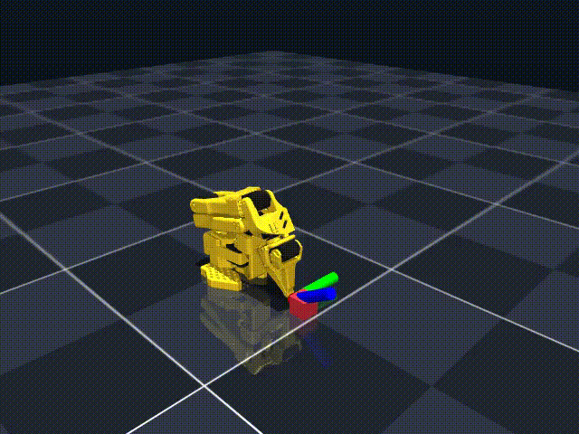

# LeDroid-101

Welcome to LeDroid-101 🤖

LeDroid-101 is my custom approach for replicating, learning, and expanding HuggingFace's SO-101 Robot arm setup. This repository is intended to be replicated by anyone to learn everything about configuring, assembling, calibrating, and using this robot in a simplified and friendly way.

We use Python version **3.13.7** and the extremely fast and deterministic package manager `uv` for managing all environments and dependencies.

> [!IMPORTANT]
> This repo is a work in progress!

## What you will find here?

* MuJoCo simulation of the SO-101 robotic arm with a 5-DOF inverse kinematics solver. (Also code supporting MuJoCo Warp)
* Python scripts for controlling the SO-101 robotic arm in real-time via USB serial communication.
* Digital Twin mode to run the robot in both simulation and real-world scenarios with the same codebase.
* Documentation and reference guides for installation, assembly, calibration, and kinematics theory.

## Getting Started

### Requirements

* Python 3.13.7
* `uv` package manager ([Instuctions here](https://docs.astral.sh/uv/getting-started/installation/))
* Clone this repository

```bash
git clone https://github.com/johannstark/LeDroid-101.git
cd LeDroid-101
```

* Setup the repo

```bash
uv sync
source .venv/bin/activate
```

* Use LeRobot package to find the serial port of your SO-101 robotic arm and calibrate it, using [this guide](https://huggingface.co/docs/lerobot/so101)
* Now you are ready!

## The main.py script

The `main.py` script is the entry point for running the SO-101 robotic arm in simulation, digital twin mode, or real-world control. It supports various tasks, including line sweeps and other demonstrations.

> [!NOTE]
> The `--port` argument is required for ***twin*** and ***real***  modes. Replace `<serial_port>` with the actual serial port of your SO-101 robotic arm.
> Find the serial port using the `lerobot-find-port` command.

* `uv run python main.py --mode sim --task line` - Run the simulation with a Cartesian line sweep task.
* `uv run python main.py --mode sim --task line --record --record-path video.mp4` - Record the simulation execution to a video file.
* `uv run python main.py --mode twin --port <serial_port> --task line` - Run the digital twin mode with a Cartesian line sweep task.
* `uv run python main.py --mode real --port <serial_port> --task line` - Run the real-world robot to perform a Cartesian line sweep task.

## Demonstration: Precision Cartesian Line Sweeps & 5-DOF IK

Watch the SO-101 robotic arm execute precision linear trajectories across the X, Y, and Z axes in MuJoCo simulation! Featuring real-time RGB end-effector coordinate frame visualization, under-actuated 5-DOF position tracking, and null-space joint posture stabilization from an ergonomic mid-air pose:



> **Try it yourself!** Run the headless simulation recording directly via:
>
> ```bash
> uv run python main.py --mode sim --task line --record --record-path video.mp4
> ```

## Reference Guides & Documentation

To get started on your own replica of the SO-101 Robot Arm, we recommend reading the reference files in order. Choose the document based on your active setup stage:

| Step | Topic | Reference File | Focus |
| --- | --- | --- | --- |
| **1** | **Basics & Installation** | [docs/installation.md](docs/installation.md) | Installing Python 3.13.7, configuring `uv`, and syncing the environment defined in [pyproject.toml](pyproject.toml). |
| **2** | **Motors & Gearing** | [docs/assembly.md](docs/assembly.md#1-setting-servo-motor-ids) | Individual servo motor ID mapping (IDs 1-6) and baud rate options via `lerobot-find-port`. |
| **3** | **Physical Assembly** | [docs/assembly.md](docs/assembly.md#2-assembling-the-so-101-robot-arm) | Step-by-step assembly of STS3215 joints from Joint 1 (Base) to Joint 6 (Gripper). |
| **4** | **Calibration** | [docs/assembly.md](docs/assembly.md#3-calibration-procedures) | How to run the `lerobot-calibrate` script for both Leader and Follower configurations. |
| **5** | **LeKinematics & IK Math** | [lekinematics/theory.md](lekinematics/theory.md) <br> [docs/kinematics_math.md](docs/kinematics_math.md) <br> [lekinematics/le_kinematics.py](lekinematics/le_kinematics.py) | Forward/inverse kinematics theory, spatial Jacobians, DLS optimization, 5-DOF decoupling, and practical Python examples. |
| **6** | **MuJoCo Sim, Digital Twin & Real Control** | [docs/simulation.md](docs/simulation.md) <br> [main.py](main.py) | MuJoCo physics simulation, Gymnasium RL environment, 3D interactive viewer, Digital Twin mode (`--mode twin`), video recording (`--record`), and Cartesian end-effector line routines. |

## Contributing and Community

This project is fully open-source and welcoming replication. Feel free to open issues or Pull Requests with your own examples and use cases!

---

Made in Colombia 🇨🇴 with Love ❤️
